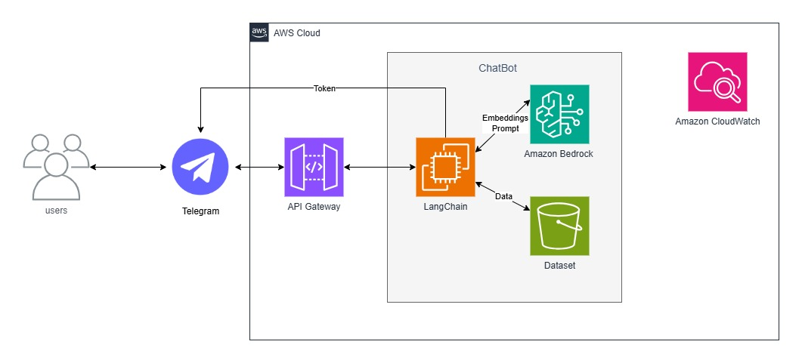

# Projeto 4 (Sprint 7 e 8)
Esse projeto foi desenvolvido pela Squad 4 como parte da avaliação das 7º e 8º sprints do programa de bolsas Compass UOL para formação em Inteligência Artificial para AWS da Turma de Maio de 2025.

# Chatbot Jurídico com RAG + Bedrock
## Sobre o projeto
O projeto teve como objetivo o desenvolvimento de um chatbot para consulta de documentos jurídicos, utilizando uma arquitetura baseada em RAG (Retrieval Augmented Generation) com LangChain e Chroma para indexação e recuperação dos dados. Tendo como tecnologias AWS, o Amazon Bedrock para geração de respostas, o Amazon S3 para armazenamento dos documentos, e o Amazon CloudWatch para registro e monitoramento dos logs. A interface de interação implementada foram para o uso do Telegram e pelo Streamlit.

## Arquitetura


## Configuração
### Pré-requisitos
- Conta AWS.
- AWS CLI configurada (opcional).
- Python.

## Utilização
Realize o git clone do repositório.
```bash
git clone https://github.com/Compass-pb-aws-2025-MAIO/sprints-7-8-pb-aws-maio.git
```
Após isso, entre no repositório do projeto e crie um ambiente virtual Python.
```bash
python -m venv venv
```
Execute o ambiente virtual.
```bash
# Windows
source venv/Script/activate
```
```bash
# Linux
source venv/Bin/activate
```
Realizado isso, execute a instalação das dependências.
```bash
pip install -r requeriments.txt
```
Para utilizar o projeto via Streamlit, acesse o diretório _chatbot_.
```bash
cd app/chatbot
```

**ATENÇÃO**: será necessário as variáveis de ambiente de sua conta AWS ao arquivo .env (por padrão, estará como .env.c, sendo necessário retirar o ".c" para o reconhecimento por parte dos códigos Python).

```bash
# formato de corpo do .env
AWS_ACCESS_KEY_ID=
AWS_SECRET_ACCESS_KEY=
AWS_SESSION_TOKEN=
AWS_BUCKET=
AWS_REGION=
```

Execute o comando Streamlit.
```bash
streamlit run main.py
```
Faça o acesso pelos link apresentados no terminal, ou pela janela do navegador padrão aberto após a execução.

## Tecnologias
### Infraestrutura AWS
* AWS CloudWatch.
* AWS Bedrock.
* AWS S3.

### Bibliotecas
* LangChain.
* ChromaDB.
* Boto3.
* pyPdf.
* Streamlit.

### Modelos AWS Bedrock utilizados:
* amazon.titan-embed-text-v2:0.
* amazon.titan-text-express-v1.

## Dificuldades
As principais dificuldades encontradas no desenvolvimento desse desafio foram:

### 1. Variáveis de Ambiente
Foi encontrando difículdades para uso das variáveis de ambiente da AWS para acesso aos recursos AWS. Sendo criado um arquivo.py responsável para teste e verificação das variáveis para continuação do desenvolvimento do projeto.

### 2. Acesso ao dataset no S3
Utilização dos documentos do dataset ao código do projeto, para teste do chatbot via Streamlit, realizando uma implementação de um carregamento recursivo para o _download_ do S3 para a máquina local para uso.

### 3. LangChain + Chroma
Aplicação e utilização dos modelos disponibilizado pelo AWS Bedrock para o uso e transformação dos documentos do dataset baixado localmente para o chatbot.

### 4. Obter resposta do RetrievalQA
Houve dificuldades para obter uma resposta vinda do chatbot por erros da vetorização do dataset baixado.

### 5 Memória do Chatbot
Tentamos implementar o armazenamento das perguntas anteriores ao chatbot, para dar continuidade a uso da aplicação e de suas respostas. Mas não tivemos sucesso por problemas encontrados na saída da resposta após a implementação. 

### 6. Implementação para o EC2
Não foi possível fazer a portabilidade do projeto em local para uso em EC2, dado a dificuldade tecnica em integrar essa parte ao projeto para realização do teste, sendo por questão técnica, de organização e tempo.

### Solução implementada:
- Optou-se em manter a funcionabilidade de ambiente local pelo Streamlit.

## Autores
- [Maria Eduarda da Nóbrega](https://github.com/eduardanb)
- [Vinícius França de Oliveira Sousa](https://github.com/marditin)
- [João Vitor Campõe Galescky](https://github.com/Joaogalescky) 
- [Gabriel Medeiros Nóbrega](https://github.com/Prozis-dev)

---

**Desenvolvido pela Squad 4 - Compass UOL Program 2025**